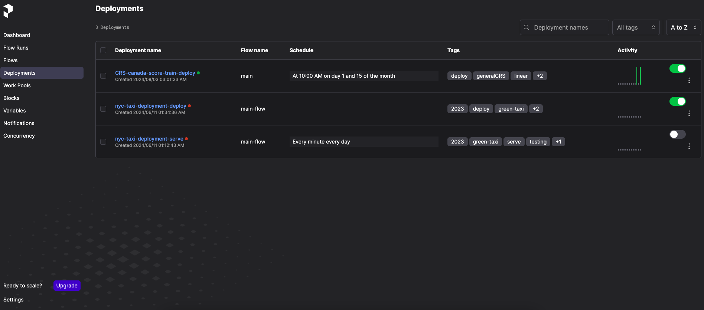
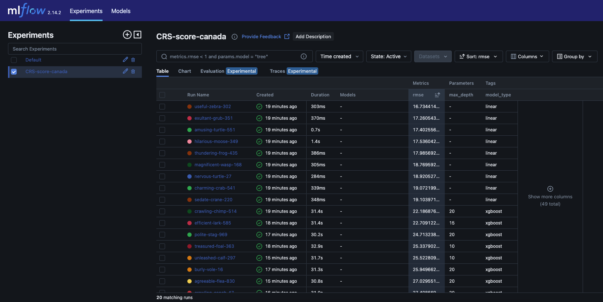
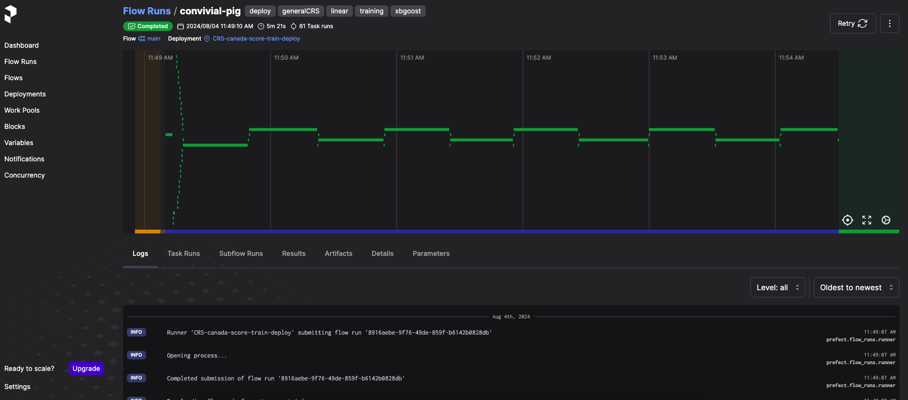
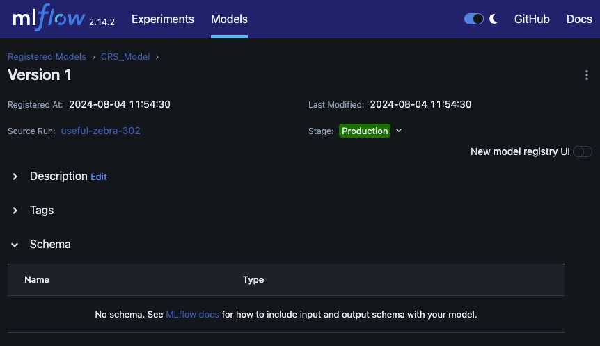
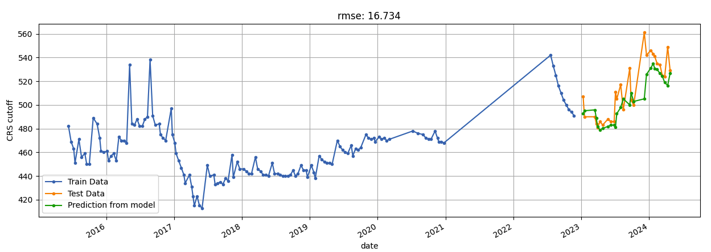
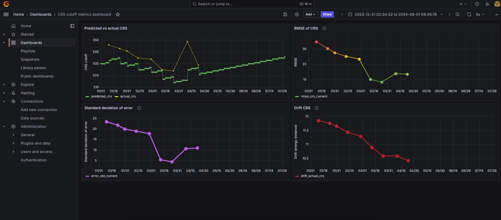
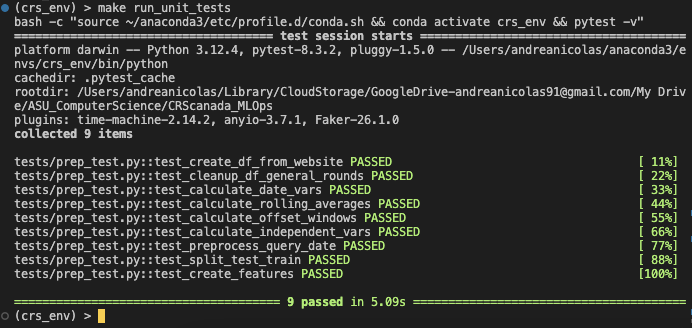
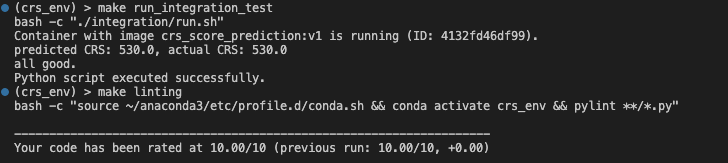

# CRS Canada immigration cutoff score analysis
## Overview
This project consists of an application that predicts future cutoff scores for the Comprehensive Ranking System (CRS) that Canada uses to grant permanent residence invitations.

### Problem statement
The invitations rounds happen in infrequent intervals and are subject to several factors both seasonal and policy-based, making it complicated for any future applicants to estimate the CRS score to aim for by the time they submit an application to Express Entry.

### Proposed solution

This application helps applicants prepare better their Express Entry application by having a more robust prediction on the cutoff score they will need to clear to get an invite for permanent residence. 

### Background information
The government of Canada launched Express Entry in January of 2015 for certain economic immigration programs, where candidates with higher CRS scores have a higher likelihood of being invited. Potential candidates get awarded points depending on ther background, education, work experience, ties to canada, and language requirements.

When Express Entry launched, Canada stated that those who meet the criteria of one of the federal immigration programs managed by the Express Entry system (i.e. Federal Skilled Worker, Canadian Experience Class and Federal Skilled Trades Program) are accepted into a pool of candidates, some of which get an invitation to immigrate if they fulfill a minimum CRS score. Some rounds are specific for each category, and some 'General' rounds allow all applicants to apply as long as they are eligible for one of these four categories.

The minimum cutoff CRS score where a candidate is eligible for an immigration offer shows effects from both seasonal fluctuations, the effects of COVID, the number of applicants and policy changes, etc.

For a thorough analysis of the data and the logic behind the selected ML models, please see the `01_development/CRScanada_modelDevelopment.ipynb` jupyter notebook.

## MLOps Summary

We are doing the following:
1. 01_development
   - We scrape raw data from the canadian website, massage it, and fit several models until we find the best one. 
   - We work with **Mlflow** an a simulated **postgreSQL** to track all experiments and register the best model. 
   - We use **Localstack** to simulate an AWS **S3** bucket and avoid usage fees for the time being.
   - We fully deploy the training workflow via **Prefect**.
2. 02_deployment
   - We create a web-service app that will predict the estimated CRS cutoff score given a particular date.
   - We use **Docker** to containerize and deploy the app.
3. 03_monitoring
   - We use **Evidently** to calculate some performance metrics.
   - We plot a custom dashboard using **Grafana and postgreSQL** that reports both the performance metrics and the predicted vs actual CRS scores.
   - We use **Prefect** to keep tabs on everything.
4. Best practices
   - We perform linting via **pylint**.
   - We perform unit testing of all preprocessing utils via **pytest**.
   - We perform integration testing
   - We streamline everything via **makefiles**.

## Walkthrough
NOTE: The following was run in a macOS monterey. If you are running this in windows or linux, please pay special attention to the comments specific to your platform as you go through this walkthrough.

1. Install [anaconda](https://www.anaconda.com/) and [docker](https://www.docker.com/products/docker-desktop/). We are running anaconda 2.5.2 and docker 4.33.0 at the time of this walkthrough.
   
2. Make sure there is no python/conda environment running no your terminal and run:
```bash
make setup
source setup_env.sh
```

This will create the `crs_env` conda environment, set up the AWS dummy credentials by copy/pasting the `.aws` files on this repo to your root, and activating on the current terminal the conda env as well as some environment variables needed by mlflow.

Note that the bash file also builds the `localstack` & `postgreSQL` docker containers necessary for the simulation of `s3` & `db`, and creates an s3 bucket called `crs-data`.

**WINDOWS USERS!**: 
This setup is set for linux/mac. If you are a windows user please follow the instructions [here](#windows-user).

You can verify the docker and aws setup via
```bash
docker compose ps
aws --endpoint-url=http://localhost:4566 s3 ls
```

NOTE: if you don't want to use dummy aws credentials/don't want to overwrite your credentials and want alternatives, please follow the instructions [here](#aws-credential-setup)

1. start mlflow and prefect via:
```bash
make start
```

This will start on the background both prefect and mlflow. It will also use the `01_development/main.py` script to initialize a deployment called `CRS-canada-score-train-deploy`.



4. Start model training by kicking off the first deployment flow run via:
```bash
make prefect_deploy_main
```

You should see data and tracking info being displayed on MLflow (http://127.0.0.1:5000/) 



and prefect (http://127.0.0.1:4200/)



In the end you should see 20 models on the system.

The system is running both linear fittings and xgboost models, so the pipeline should take **~5 minutes** to run.

One linear regression model was selected as the best one and therefore has been registered in MLflow.



The best model performs as follows (you can also find this image inside the artifacts of the registered model):




1. Deploy the app in a docker container by running:
```bash
docker compose up crs_score_prediction -d --build
```
**LINUX USERS!**: This setup is using an mlflow tracking uri that works for mac and windows. If you are running this on a linux machine please follow these instructions [here](#linux-user).


You can test the app via:
```bash
python 02_deployment/test.py
```

You should get the following answer on the CLI:
```bash
{'CRS_pred': 535.0, 'query_date': '31-Jul-2024'}
```


6. Monitor the performance of the app/best model by running:
```bash
make monitoring
```

Go to grafana (http://localhost:3000/login) and log in with the following credentials:

username: admin
password: admin

You should see a prepared dashboard called `CRS cutoff metrics dashboard` that is monitoring the following metrics:
- CRS score predicted vs actual
- rmse
- standard deviation of the error
- drift



In general we care the most about RMSE. Usually anything below ~20 is fine (its relatively easy to get 20 points on the canadian scoring system).

The high drift is understandable since the CRS system had an overhaul starting 2023, and we are comparing data of 2024 against data from 2015-2023. As more general rounds are held, the drift should go down eventually.

If you want to see the raw data on PostgreSQL please follow the instructions [here](#postgresql)

## Good practices

Run all unit tests via:
```bash
make run_unit_tests
```


Run all integration tests via:
```bash
make run_integration_test
```
check the linting performance via:
```bash
make linting
```



## Cleanup

To stop all docker containers and all servers that were running in the background, run:

```bash
docker compose down -v
make stop
```

## EXTRAS

### postgreSQL

If you want to see the raw data, simply go to (http://localhost:8080/) and enter the following:

- system: postgresQL
- server: db
- username: postgres
- password: example
- database: test

### AWS credential setup

We need to make sure that you got the credentials in the `.aws` root folder matching those inside the docker-compose file.

You have two options:

1. You already have aws credentials inside `.aws` and you don't want to bother changing the values.
    Get your credential info via `cat ~/.aws/credentials` and copy-paste those values inside `docker-compose.yml` on the main folder. 
    Basically edit:
    ```bash
    ...
    s3:
    image: localstack/localstack
    ...
    environment:
      ...
      - AWS_ACCESS_KEY_ID=abc
      - AWS_SECRET_ACCESS_KEY=xyz
    ```

    You may need to also update your environment variables so you are using your actual credentials:
    ```bash
    export AWS_ACCESS_KEY_ID=abc
    export AWS_SECRET_ACCESS_KEY=xyz
    ```
    
2. You have no aws credentials set up and want to try dummy ones.
   Copy the .aws folder from the main project folder to your root via `cp -r .aws ~/ ` for linux/mac or `xcopy /E /I /H /R /Y .aws C:\Users\%USERNAME%\.aws` for windows. I am assuming here that your current working directory is the mlops project.


### WINDOWS USER
Copy the .aws folder from the main project folder to your root via `xcopy /E /I /H /R /Y .aws C:\Users\%USERNAME%\.aws` for windows. I am assuming here that your current working directory is the mlops project.

### LINUX USER
When creating the `crs_score_prediction` container inside `docker-compose.yml`, we are setting the following variable:

```bash
...
environment:
      - MLFLOW_TRACKING_URI=http://host.docker.internal:5000
```

**This variable only works for Windows and MacOS.**

If you are doing docker-compose in a linux machine, then you have to update this variable inside docker-compose as:

```bash
environment:
      - MLFLOW_TRACKING_URI=http://<host-ip>:5000
```

Where the <host-ip> is the actual IP address of your host machine.

According to google, sometimes this works:

```bash
environment:
      - MLFLOW_TRACKING_URI=http://172.17.0.1:5000
```

So edit the `MLFLOW_TRACKING_URI` inside `docker-compose.yaml` before deploying with docker.